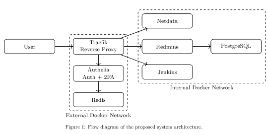

# DevOps Delivery Platform

DevOps engineering project implementing automated software delivery workflows, testing infrastructure and deployment automation.

[📄 View report](./report)
[💻 Source code](./code)

---

## Overview

This project explores modern DevOps practices through the design and implementation of an automated delivery workflow.

The system focuses on:

- reproducible builds
- automated testing
- deployment workflows
- infrastructure automation

---

## Architecture

---

## Technologies

- Java
- CI/CD tooling
- Automated testing
- Deployment infrastructure

---

## Results

Achieved 100/100 assessment score.
